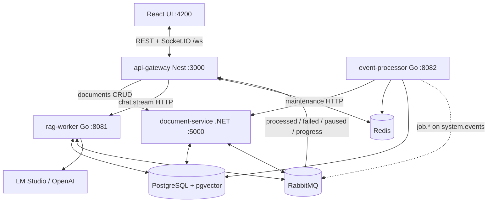
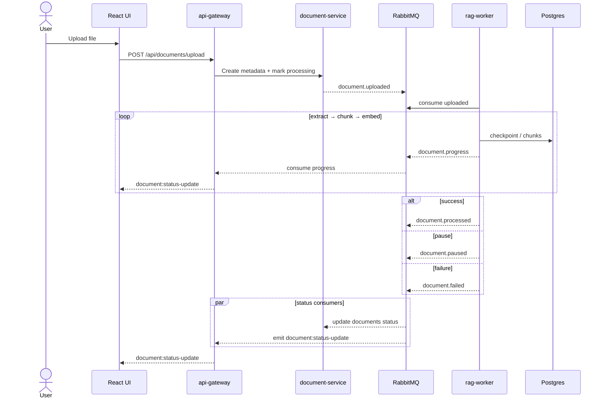
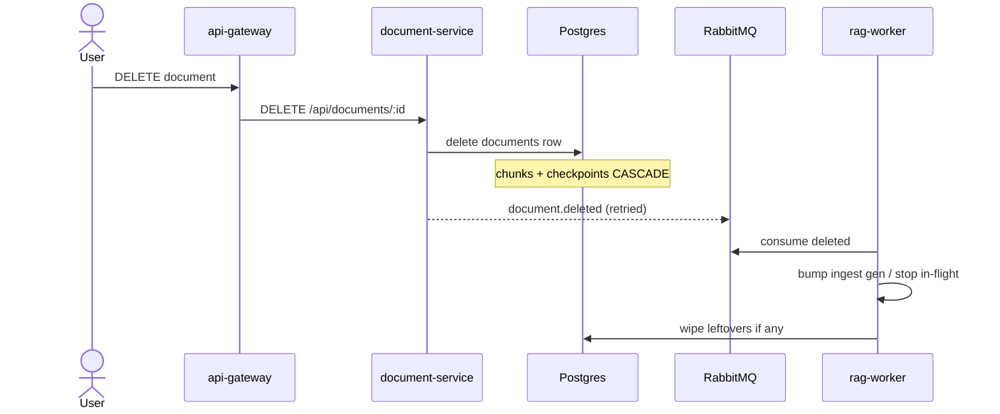
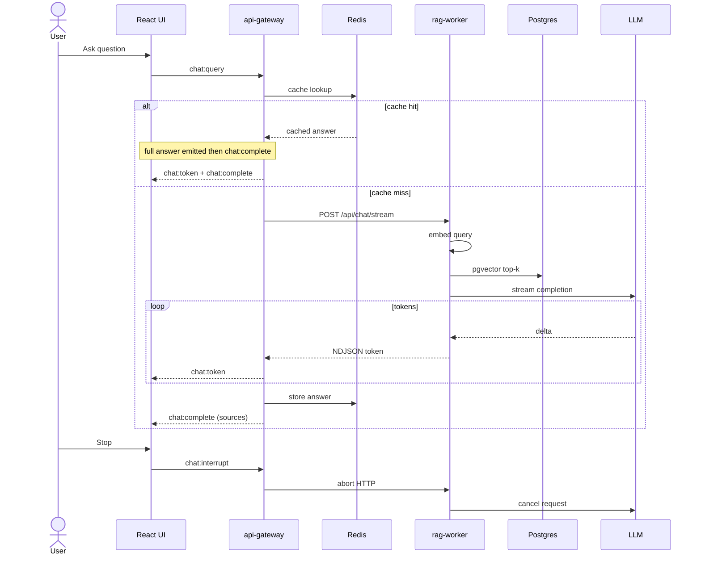

# RAGPolyglot

Local **polyglot RAG** system: upload documents, extract/OCR → chunk → embed → pgvector, then chat with an LLM grounded only in retrieved context — streamed live to a React UI.

Built as an Nx monorepo with NestJS, .NET, Go, React, PostgreSQL/pgvector, Redis, and RabbitMQ. Useful as a **portfolio piece** (real service boundaries and an event-driven pipeline) and as a **runnable local demo** (`docker compose` + LM Studio or OpenAI).

> **Not production.** Auth is off; this is a trusted local stack. Features are still evolving.

## Why this shape

| Choice                                       | Intent                                                                               |
| -------------------------------------------- | ------------------------------------------------------------------------------------ |
| Separate document / RAG / job / BFF services | Clear ownership (metadata vs vectors vs background work vs edge)                     |
| RabbitMQ events                              | Async ingest, pause/progress, delete stop-signals — not request/reply for heavy work |
| Go rag-worker                                | CPU/IO-heavy OCR, embed, search, LLM HTTP                                            |
| .NET document-service                        | Document lifecycle + Postgres schema                                                 |
| Nest gateway                                 | Upload, Redis cache, Socket.IO streaming, metrics aggregation                        |
| Shared TS contracts                          | Gateway + UI stay aligned on statuses and events                                     |

## What you can do

- Upload text/PDF (OCR when needed), watch **extracting / embedding** progress
- **Pause / resume**, change OCR language mid-extract, **retry**, **delete while processing**
- Agent chat with **live tokens**, sources, Stop/`chat:interrupt`, Redis answer cache
- Dashboard: service health + 24h metrics (cache, queues, ingest/query timings)

## Stack

| Piece           | Tech                                   |
| --------------- | -------------------------------------- |
| API gateway     | NestJS (REST + Socket.IO)              |
| Documents       | .NET 10 Minimal API                    |
| RAG worker      | Go (extract → embed → pgvector → LLM)  |
| Background jobs | Go event processor                     |
| Frontend        | React + Vite                           |
| Data            | PostgreSQL + pgvector, Redis, RabbitMQ |

## Architecture

### System map



### Ingestion



Resume re-publishes `document.uploaded`. Pause → `document.pause` → worker checkpoints → `document.paused`.

### Deletion



### Chat



Answers are **LLM-only from retrieved chunks** (no extractive fallback). Embedding hash fallback is off by default (`EMBEDDING_FALLBACK=false`); use `true` for CI/`--profile test` when you lack a real embed API.

## Prerequisites

- Docker + Docker Compose
- Node.js 22+ (Nx, frontend)
- Optional for real chat: [LM Studio](https://lmstudio.ai/) (or OpenAI) with an embedding model + chat model loaded

## Run locally

```bash
cp .env.example .env
npm install
docker compose up --build
```

Wait until containers are healthy, then:

```bash
npx nx serve react-frontend
```

| Service          | URL                                  |
| ---------------- | ------------------------------------ |
| UI               | http://localhost:4200                |
| Gateway          | http://localhost:3000                |
| RabbitMQ UI      | http://localhost:15672 (guest/guest) |
| Document service | http://localhost:5000                |
| RAG worker       | http://localhost:8081                |
| Event processor  | http://localhost:8082                |

Quick checks:

```bash
curl http://localhost:3000/api/health
curl http://localhost:3000/api/metrics
```

### LLM (required for Agent chat)

In `.env` (defaults target LM Studio on the host):

| Variable              | Purpose                                     |
| --------------------- | ------------------------------------------- |
| `LLM_MODEL`           | Chat model id (e.g. `local-model`)          |
| `LMSTUDIO_API_URL`    | `http://host.docker.internal:1234/v1`       |
| `EMBEDDING_MODEL`     | Must match what your embed endpoint returns |
| `EMBEDDING_DIMENSION` | Must match vector column / model output     |

OpenAI: set `OPENAI_API_KEY` (and optionally `OPENAI_API_BASE_URL`). Chat prefers `LMSTUDIO_API_URL` when set.

Start the LLM **before** Agent mode. Full knobs (OCR pools, auto-retry, upload limits): see `.env.example`.

### First walkthrough

1. Open http://localhost:4200 — Dashboard should show services up.
2. Upload a `.txt` or PDF → status moves through processing → **ready** (progress on the document).
3. Agent → ask something answered only by that file → tokens stream; sources on complete.
4. Try **Stop** mid-answer; optional: **Pause** during a large PDF OCR, **Resume**, or **Delete** while processing.

## Tests

**Unit** (no full stack):

```bash
npx nx run-many -t test --exclude=api-gateway-e2e,react-frontend-e2e
```

**Integration** (Compose `--profile test` + `tools/llm-stub`; project `ragpolyglot-ci`):

```bash
npm run test:integration
```

Needs `.env` and `.env.test.example`. No LM Studio. Successful runs tear down with `-p ragpolyglot-ci` (a plain `docker compose down` will not stop that project).

## Layout

```
apps/
  api-gateway/          Nest BFF — REST, WebSocket, cache, metrics
  api-gateway-e2e/      Integration tests (llm-stub)
  document-service/     .NET metadata + events + schema
  document-service.Tests/
  rag-worker/           Go ingest + search + LLM
  event-processor/      Go scheduled jobs
  react-frontend/       Dashboard, upload, agent chat
libs/
  shared/               TS contracts (@ragpolyglot-shared)
tools/
  llm-stub/             OpenAI-compatible stub for CI
```

Per-service detail: each app’s `README.md`.

## Scope

**In:** event-driven ingest with checkpoints, OCR path, live RAG chat + interrupt, pause/resume/delete-while-processing, metrics dashboard, unit + CI integration tests.

**Out:** auth/multi-tenant, production HA, browser e2e, polished ops. Trusted local/demo only.

## License

Private / portfolio — not published as an open-source product unless stated otherwise.
